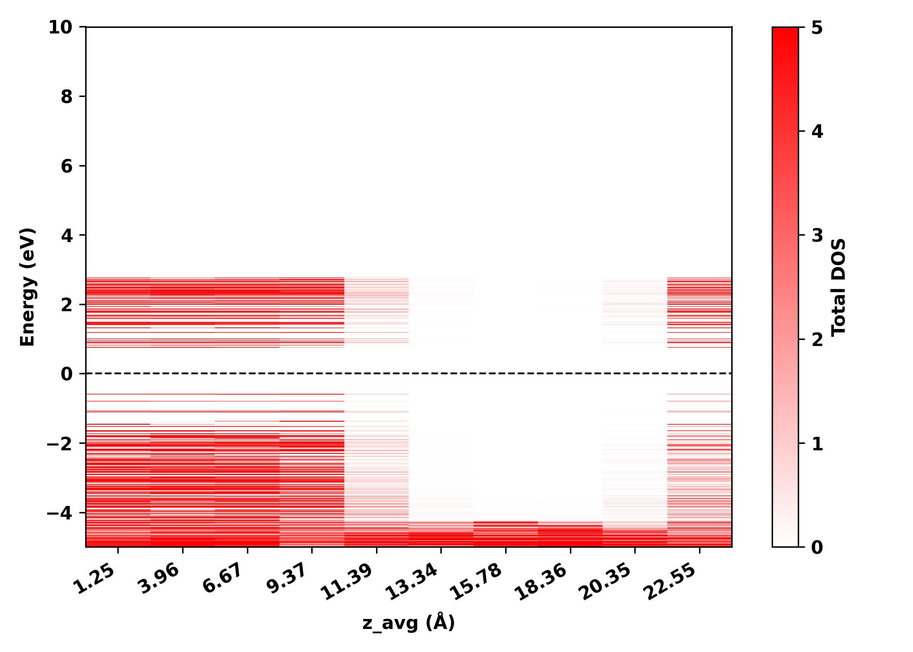

# Color-PDOS: 层分辨投影态密度图工具

基于 PWmat 的 `plot_DOS_interp.x` 实现层分辨 PDOS（投影态密度）计算与可视化。
将体系沿 z 方向均分为若干层，分别计算每层的 PDOS，最终生成以 z 坐标为横轴、能级为纵轴、
PDOS 强度为颜色的二维色块图。

## *典型应用：界面带阶、缺陷态定位*

## 目录结构

```
color-pdos/
├── README.md                   # 本文件
├── DOS.input                   # plot_DOS_interp.x 参数示例
├── figs/                       # 示例图片
│   └── section_dos.png
├── python_script/              # Python 版脚本
│   ├── section_pdos.py          #   一站式：分层 + 调用 + 合并 + 画图
│   └── plot_section.py          #   独立画图脚本（已有 section_dos.dat 时用）
├── fortran_script/             # 旧版 Fortran + bash 实现（历史参考）
│   ├── Color-PDOS.sh
│   ├── Color-PDOS_order.sh
│   ├── partial_and_coor.x
│   ├── merge_DOS.x
│   ├── merge_all_origin.x
│   └── src/
│       ├── partial_and_coor.f90
│       ├── merge_DOS.f90
│       └── merge_all_origin.f90
└── plot_dos_interp/            # PWmat 自带工具（源码 + 二进制）
    ├── plot_DOS_interp.f90
    ├── plot_DOS_interp.x
    └── ... (依赖模块)
```

## 工作原理

1. 读取 `atom.config`，在原子行末尾追加标签列 1，生成 8 列 `atom_tag.config`
2. 从 `atom.config` 读取 z 方向晶格常数 Lz，用于分数坐标→笛卡尔坐标转换
3. 按 z 坐标从小到大排序原子，均分为 `--layers` 层（余数分配给前几层）
4. 对每一层：
   - 生成带权重列的 `atom.config`（该层原子 w=1，其余 w=0）
   - 在 `tmp/PDOS{N}/` 目录下收集所有必需文件（复制 + 符号链接）
   - 调用 PWmat 的 `plot_DOS_interp.x` (PATH 命令) 计算该层 PDOS
   - 读取 `DOS.totalspin` 提取 (Energy, Total) 两列
   - 计算该层原子的平均 z 坐标（笛卡尔，单位 Å）
5. 合并所有层 → `section_dos.dat`（三列：z_avg, energy, total）
6. 用 `pcolormesh` 绘制 2D 色块图 → `section_dos.png`（白→红 colormap）

## 依赖

- Python 3.x
- numpy
- matplotlib
- PWmat 的 `plot_DOS_interp.x`（需在 PATH 中）

## 使用方法

### 基本用法

将 PWmat 计算产生的文件（`atom.config`、`REPORT`、`OUT.EIGEN`、`*.UPF`、`bpsiio*`、`OUT.SYMM`、`OUT.IND_EXT_KPT` 等）
以及 `DOS.input` 放入 `python_script/` 目录，然后运行：

```bash
cd python_script/
python section_pdos.py
```

默认分为 3 层。

### 自定义参数

```bash
# 分 4 层
python section_pdos.py --layers 4

# 指定 colormap 最大值（压制极端峰）
python section_pdos.py --cmax 5

# 限制画图能量范围
python section_pdos.py --enerange -20 5

# 对齐费米面到 0，绘制费米面虚线
python section_pdos.py --fermi

# 设置图片 DPI
python section_pdos.py --dpi 150

# 组合使用
python section_pdos.py --layers 10 --cmax 10 --enerange -15 5 --fermi
```

### 完整参数列表

| 参数 | 类型 | 默认值 | 说明 |
|---|---|---|---|
| `--layers` | int | 3 | 分层数（原子按 z 坐标排序后均分） |
| `--cmax` | float | None | colormap 最大上限值（默认自动） |
| `--enerange` | float float | None | 画图能量范围，如 `-20 5`（默认全量） |
| `--dpi` | int | 300 | 输出图片 DPI |
| `--fermi` | flag | False | 读取 OUT.FERMI 对齐费米面到 0，并绘制黑色虚线 |

## 输入文件

以下文件需放在 `python_script/` 目录下（或通过符号链接指向 PWmat 计算目录）：

| 文件 | 用途 | 必需 |
|---|---|---|
| `atom.config` | 结构文件（7 列：type x y z mfx mfy mfz） | 是 |
| `DOS.input` | `plot_DOS_interp.x` 的参数 | 是 |
| `REPORT` | PWmat SCF/NONSCF 报告 | 是 |
| `*.UPF` | 赝势文件（AAA.UPF, BBB.UPF, ...） | 是 |
| `OUT.EIGEN` | 特征值（二进制） | 是 |
| `OUT.SYMM` | 对称性信息 | 是 |
| `OUT.IND_EXT_KPT` | 扩展 k 点信息 | 是 |
| `bpsiio*` | 投影波函数（二进制，如 `bpsiiofil100001`） | 是 |
| `OUT.FERMI` | 费米能级（`--fermi` 时需要） | 否 |

脚本运行时会将上述文件自动复制到 `tmp/PDOS{1..N}/` 子目录中。

### `DOS.input` 格式

```
1              # ipart_DOS: 0=全部原子, 1=部分原子（需 atom.config 加权重列）
0              # interp: 0=不插值, 1=插值（需 OUT.overlap_uk）
0.01 4000      # E_b(eV) 能量展宽, nE 能量网格点数
8 8 8          # nm1 nm2 nm3 插值网格（interp=0 时不使用，但必须存在）
0              # iocc: 0=不用 IN.OCC_ADIA, 1=用
```

> **重要**：第 1 行 `ipart_DOS` **必须为 `1`**。本工具靠 `atom.config` 第 8 列权重区分各层原子；
> 若为 `0`，`plot_DOS_interp.x` 会忽略权重列、对所有原子算总 DOS，导致每层结果完全相同，
> 看不到层分辨结构与带阶。

## 输出文件

| 文件 | 说明 |
|---|---|
| `atom_tag.config` | 带 8 列标签（全 1）的中间文件 |
| `section_dos.dat` | 3 列数据（z_avg(Å), Energy(eV), Total PDOS），共 layers × nE 行 |
| `section_dos.png` | 2D 色块图（pcolormesh + 白→红 colormap） |
| `tmp/PDOS{N}/` | 每层独立的 PWmat 计算目录（含 atom.config, DOS.input 等） |

## 示例



## 注意事项

1. **运行环境**：`plot_DOS_interp.x` 是 Linux ELF 二进制，整个流程必须在 Linux 服务器上运行
2. **运行时间**：每层调用 `plot_DOS_interp.x` 会读取波函数文件，层数较多时较慢
3. **`DOS.input` 的 `ipart_DOS` 必须为 1**：否则权重列被忽略，各层 DOS 完全相同
4. **z 坐标**：`section_dos.dat` 中的 z_avg 已从分数坐标转换为笛卡尔坐标（Å），通过读取 `atom.config` 晶格矢量第 5 行的 z 分量实现
5. **分层策略**：原子按 z 坐标升序排列后均分 N 层；如有余数（如 160 原子分 3 层：54, 53, 53），余数分配给前几层
6. **费米面对齐**：默认不启用；使用 `--fermi` 读取 `OUT.FERMI`（格式：`Fermi Energy = xxx eV`），能量减去 E_F，费米面位于 E=0 并绘制黑色虚线
7. **colormap**：使用白→红自定义渐变（白色为 0，红色为最大值），不趋近黑色，视觉更清晰
8. **stress 兼容**：`atom.config` 晶格行带 `stress:` 字段（MD 输出）可正常解析，仅取前几列晶格矢量

## 独立画图脚本

`python_script/plot_section.py` 用于已有 `section_dos.dat` 时单独画图，不需 PWmat 计算：

```bash
cd python_script/
python plot_section.py
```

## 旧版脚本（Fortran + bash）

`fortran_script/` 目录保留了原始的 Fortran + bash 实现作为历史参考，已被 Python 版替代：

| 文件 | 说明 |
|---|---|
| `Color-PDOS.sh` / `Color-PDOS_order.sh` | 原 bash 主脚本 |
| `partial_and_coor.x` (源码 `src/partial_and_coor.f90`) | 分层 + 标记 move_flag + 计算平均 z |
| `merge_DOS.x` (源码 `src/merge_DOS.f90`) | 收集每层 PDOS |
| `merge_all_origin.x` (源码 `src/merge_all_origin.f90`) | 合并 z 坐标和 DOS 数据 |

旧版与 Python 版的主要区别：
- 旧版用 vim + sort 排序，Python 版用 `np.argsort`
- 旧版每层指定固定原子数，Python 版用 `--layers` 均分
- 旧版需要手动修改脚本内的参数，Python 版用 CLI 参数
- 旧版 z 坐标为分数坐标，Python 版自动转换为笛卡尔坐标（Å）

## `plot_DOS_interp.x` 说明

`plot_dos_interp/` 目录包含 PWmat 的 `plot_DOS_interp.x` 源码和编译好的二进制。
该工具从 PWmat 的 SCF/NONSCF 输出（OUT.EIGEN、bpsiiofil* 等）计算 DOS，
支持通过 atom.config 的权重列（第 8 列）选择部分原子计算 PDOS。

详细接口见 `plot_dos_interp/plot_DOS_interp.f90` 开头的 User Guide。
